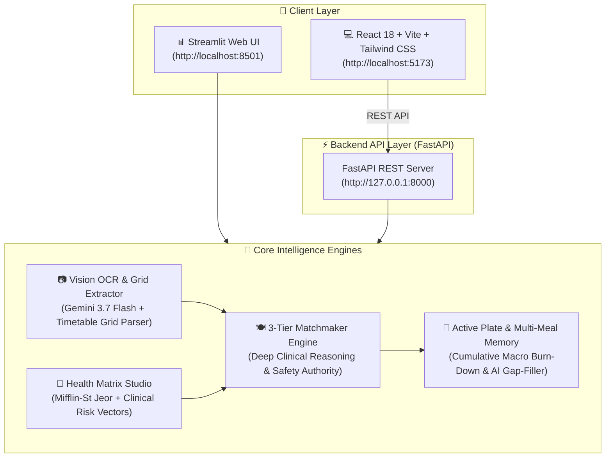

# 🥗 NutriMenu AI — Clinical 3-Tier Food Recommendation Engine

[](https://www.python.org/)
[](https://fastapi.tiangolo.com/)
[](https://react.dev/)
[](https://tailwindcss.com/)
[](https://aistudio.google.com/)
[](https://docs.pytest.org/)
[](LICENSE)

**NutriMenu AI** is an intelligent full-stack clinical recommendation platform that bridges physical restaurant menus with personalized metabolic and medical health matrices. Powered by **Google Gemini 3.7 Flash**, it digitizes complex restaurant and timetable menus, evaluates dishes against clinical guardrails, classifies them into **🟢 Tier 1: GOOD**, **🟡 Tier 2: MEDIUM**, and **🔴 Tier 3: BAD** tiers, and tracks active meal plates with multi-meal cumulative macro budgets.

---

## 🌟 Architecture & System Pipeline



---

## 🧭 Core Capabilities & Feature Suite

### 1. 📷 Multimodal Vision OCR & Timetable Grid Parser
- **Powered by Google Gemini 3.7 Flash**: High-accuracy vision recognition for restaurant menus, chalkboard specials, and university mess timetable grids.
- **Cell-by-Cell Grid Parsing**: Isolates meal slots and columns independently, preventing horizontal column text bleeding.
- **Dish Tokenization & Typo Fixing**: Splits compound lines (`Dosa, Sambhar, Chutney` $\to$ individual dishes) and autocorrects OCR typos (`Tdly` $\to$ `Idli`, `Pillka` $\to$ `Phulka`, `Rajama` $\to$ `Rajma`).
- **Multi-Layer Noise Filter**: Automatically strips template placeholders (`INSERT YOUR LOCATION HERE`), headers (`SRM UNIVERSITY`, `MENU`), timestamps (`7:30 AM - 9:15 AM`), and branding noise.

### 2. 👤 Clinical Health Matrix Studio
- **Biometric Inputs**: Age, Gender, Height, Weight, Activity Level, and Primary Goal (*Fat Loss*, *Muscle Gain*, *Maintenance*, *Healthy Aging*).
- **Clinical Condition Toggles**: Hypertension, Type 2 Diabetes, Pre-Diabetes, GERD, Hyperlipidemia, PCOS, Fatty Liver.
- **Zero-Tolerance Allergens**: Peanuts, Tree Nuts, Dairy, Gluten, Shellfish, Eggs, Soy, Sesame.
- **Live Synthesized Matrix**:
  - Mifflin-St Jeor daily caloric baseline with deficit/surplus adjustment.
  - Protein, Carbohydrate, and Fat target split bars.
  - Clinical Guardrails (Sodium ceiling, Glycemic sensitivity, Saturated fat limit, Minimum fiber).
  - Hard Exclusion Mask.

### 3. 🍽️ 3-Tier Food Recommendation Dashboard
- **Tier 1 🟢 (GOOD)**: High nutritional fit, optimal metabolic alignment, safe, health-promoting.
- **Tier 2 🟡 (MEDIUM)**: Moderate choice, acceptable with portion control or minor culinary modification.
- **Tier 3 🔴 (BAD)**: Strictly avoid, contains allergens/diet violations, high glycemic spikes, or excessive sodium/saturated fat.
- **Bespoke Dish-Level Clinical Reasoning**:
  - Detailed biochemical assessments referencing exact recipe ingredients.
  - Specific culinary green flags and red flags.
  - Actionable chef advice (e.g. *"Swap for Tandoori Paneer Tikka"*, *"Request unbuttered 100% whole wheat tandoori roti"*).
- **Deterministic Safety Authority**: Instant $0$-score override and Tier 🔴 assignment for declared allergens and ethical diets (e.g. meat on vegetarian protocols).

### 4. 🍱 Active Meal Plate & Daily Multi-Meal Memory
- **Interactive Plate Builder**: Add any recommended dish with custom portion multipliers (`0.5x`, `1.0x`, `1.5x`, `2.0x`, `3.0x`).
- **Cumulative Daily Macro Burn-Down**:
  - Two-tone progress bars tracking **Earlier Meals Logged Today** + **Current Active Plate** vs. Daily Targets.
  - Real-time remaining calorie, protein, carbohydrate, fat, and sodium safe budget calculations.
- **Multi-Meal History**: Log meals (Breakfast, Lunch, Snacks, Dinner) with timestamps and individual dish breakdowns preserved in browser storage (`localStorage`).
- **✨ Complete My Plate (AI Gap-Filler)**: Scans remaining menu items to suggest 1–2 complementary companion dishes balancing missing protein/fiber, with strict vegetarian and allergen exclusions.

### 5. 📊 Multi-Format Export Studio
- 📊 **CSV Spreadsheet** (`.csv`) for Excel & Google Sheets
- 📝 **Markdown Report** (`.md`) for Obsidian, Notion & GitHub
- 🖨️ **Printable HTML / PDF** (`.html`) ready to print or save
- 💻 **Raw JSON Payload** (`.json`) for developer integration
- 📄 **Plain Text Summary** (`.txt`) for quick review

---

## ⚡ Quickstart & Installation

### 1. Clone & Install Dependencies

```bash
git clone https://github.com/CodeClosed/AI-Project.git
cd AI-Project

# Install Python backend dependencies
pip install -r requirements.txt

# Install React frontend dependencies
cd frontend
npm install
cd ..
```

---

### 2. Configure Gemini API Key

Create a `.env` file in the project root:
```env
# Google Gemini API Key (Primary Vision & Recommendation AI Engine)
# Get your API key from Google AI Studio: https://aistudio.google.com/app/apikey
GEMINI_API_KEY=your_gemini_api_key_here

# Model Selection (Default: gemini-3.7-flash)
GEMINI_MODEL=gemini-3.7-flash
```

*(You can also configure or change your API key directly inside the web UI via the Profile Drawer).*

---

### 3. Launch the Application

#### Option A: Full-Stack React + FastAPI (Recommended)
Runs both the FastAPI backend and React frontend concurrently:
```bash
python run_fullstack.py
```
- **React Frontend**: [http://localhost:5173](http://localhost:5173)
- **FastAPI Swagger Docs**: [http://127.0.0.1:8000/docs](http://127.0.0.1:8000/docs)

#### Option B: Streamlit Web Dashboard
```bash
python run_ui.py
# or: streamlit run app.py
```
- **Streamlit UI**: [http://localhost:8501](http://localhost:8501)

---

## 🧪 Automated Test Suite

All 70 test suites run 100% offline:

```bash
python -m pytest -v
```

### Test Coverage Highlights:
| Test Module | Focus Area | Status |
| :--- | :--- | :---: |
| `tests/test_plate_optimizer.py` | Multi-dish nutrient estimation, burn-down math, vegetarian safety | ✅ PASSED (4/4) |
| `tests/test_noise_filter.py` | Multi-layer noise stripping, regex entropy, typo fixes | ✅ PASSED (6/6) |
| `tests/test_safety_and_rules.py` | Strict allergen exclusions (score = 0), diabetic glycemic penalties | ✅ PASSED (7/7) |
| `tests/test_recommendation_engine.py` | 3-Tier classification, fuzzy OCR handling, batch matchmaker | ✅ PASSED (7/7) |
| `tests/test_gemini_client.py` | Typed error handling, timeouts, 429 rate limits, candidate failover | ✅ PASSED (9/9) |
| `tests/test_matrix_generator.py` | Metabolic energy equations, macro distribution, clinical vectors | ✅ PASSED (3/3) |
| `tests/test_integration_pipeline.py` | End-to-end OCR $\to$ Matrix $\to$ 3-Tier Matchmaker | ✅ PASSED (2/2) |
| `tests/test_recognizer.py` | Layout analysis, bounding box geometry, image stream support | ✅ PASSED (5/5) |
| `tests/test_nutrition_ai.py` | Dish evaluator, macro splits, markdown serialization | ✅ PASSED (5/5) |
| `tests/test_config.py` | Config getters, API key detection, fallback candidates | ✅ PASSED (4/4) |
| `tests/test_extraction_validator.py` | Validation rules, confidence scoring | ✅ PASSED (12/12) |
| `tests/test_openrouter_extractor.py` | Vision extractor fallback pipeline | ✅ PASSED (6/6) |

---

## 🛡️ Deterministic Safety Rules & Authority Hierarchy

To guarantee clinical safety, recommendations follow a strict two-stage hierarchy:

```
                      [ Evaluated Dish ]
                              │
               ┌──────────────┴──────────────┐
               ▼                             ▼
       [ Allergen Match? ]         [ Dietary Violation? ]
         (e.g., Peanuts)           (e.g., Meat on Vegetarian)
               │                             │
               └──────────────┬──────────────┘
                              ▼
                     [ Hard Conflict Detected? ]
                              │
                    ┌─────────┴─────────┐
                   YES                  NO
                    ▼                   ▼
           🔴 TIER 3: BAD      [ Calculate Continuous ]
          Fit Score = 0/100    [ Fit Score (0 - 100)  ]
        (Zero AI Override)              │
                                        ▼
                               🟢 GOOD / 🟡 MEDIUM / 🔴 BAD
```

1. **Deterministic Override**: If a dish contains declared allergens (e.g. peanuts, tree nuts, gluten) or violates explicit dietary choices (e.g. meat for a vegetarian, dairy for a vegan), it is **instantly forced to Tier 🔴 BAD (Fit Score = 0)**.
2. **Zero AI Override**: Generative AI models are never permitted to override hard safety constraints.

---

## 📡 REST API Documentation

The FastAPI backend exposes standard OpenAPI REST endpoints:

- `POST /api/ocr/extract`: Multipart image file upload. Runs Gemini 3.7 Flash vision extraction and grid parsing. Returns all recognized dishes.
- `POST /api/matrix/generate`: Accepts user biometrics and clinical conditions. Returns daily metabolic energy and clinical risk vector matrix.
- `POST /api/recommend/evaluate`: Evaluates menu dishes against nutritional matrix using Gemini 3.7 Flash. Returns 3-tier classification and structured reports.
- `POST /api/plate/evaluate`: Evaluates multi-dish plate, computing cumulative macronutrients and remaining daily budget.
- `POST /api/plate/complete`: Scans remaining menu dishes to suggest 1–2 companion items matching health matrix and dietary exclusions.
- `GET /api/health`: Service health status, Gemini availability, and active model.

Interactive documentation is available at [http://127.0.0.1:8000/docs](http://127.0.0.1:8000/docs).

---

## 📁 Repository Structure

```
AI-Project/
├── backend/
│   └── api.py                    # FastAPI REST server
├── frontend/
│   ├── src/
│   │   ├── components/
│   │   │   ├── AccountDrawerModal.jsx        # Health profile & live matrix studio
│   │   │   ├── MenuUploadSection.jsx         # Gemini 3.7 Flash OCR menu scanner
│   │   │   ├── RecommendationTableSection.jsx # 3-tier recommendations dashboard
│   │   │   └── MealPlateDrawer.jsx           # Active meal plate & multi-meal tracker
│   │   ├── App.jsx               # Main React application
│   │   ├── api.js                # API client
│   │   └── index.css             # Tailwind CSS & glassmorphic styles
│   ├── package.json
│   └── vite.config.js
├── src/
│   ├── gemini_client.py          # Google Gemini 3.7 Flash API Client
│   ├── gemini_extractor.py       # Multimodal table grid OCR menu extractor
│   ├── plate_optimizer.py        # Multi-dish plate synergy & companion suggester
│   ├── matrix_generator.py       # Mifflin-St Jeor metabolic & clinical matrix
│   ├── recommendation_engine.py  # 3-tier classification & safety rule authority
│   ├── noise_filter.py           # Multi-layer OCR noise filter & typo correction
│   ├── pipeline.py               # End-to-end menu recognition pipeline
│   ├── models.py                 # Data classes & schemas
│   └── config.py                 # Centralized configuration & thresholds
├── tests/                        # 100% offline pytest test suites (70 tests)
├── app.py                        # Streamlit application
├── run_fullstack.py              # Full-stack launcher (FastAPI + React)
├── run_ui.py                     # Streamlit launcher
└── requirements.txt              # Python dependencies
```

---

## ℹ️ Medical & Nutritional Guidance Disclaimer

**Notice**: Recommendations provided by NutriMenu AI are personalized computational estimates based on user-entered parameters, Mifflin-St Jeor metabolic equations, and published clinical nutritional literature. This application is not a medical device and does not substitute for personalized medical diagnoses, treatments, or dietary prescriptions from a licensed physician or registered dietitian.
