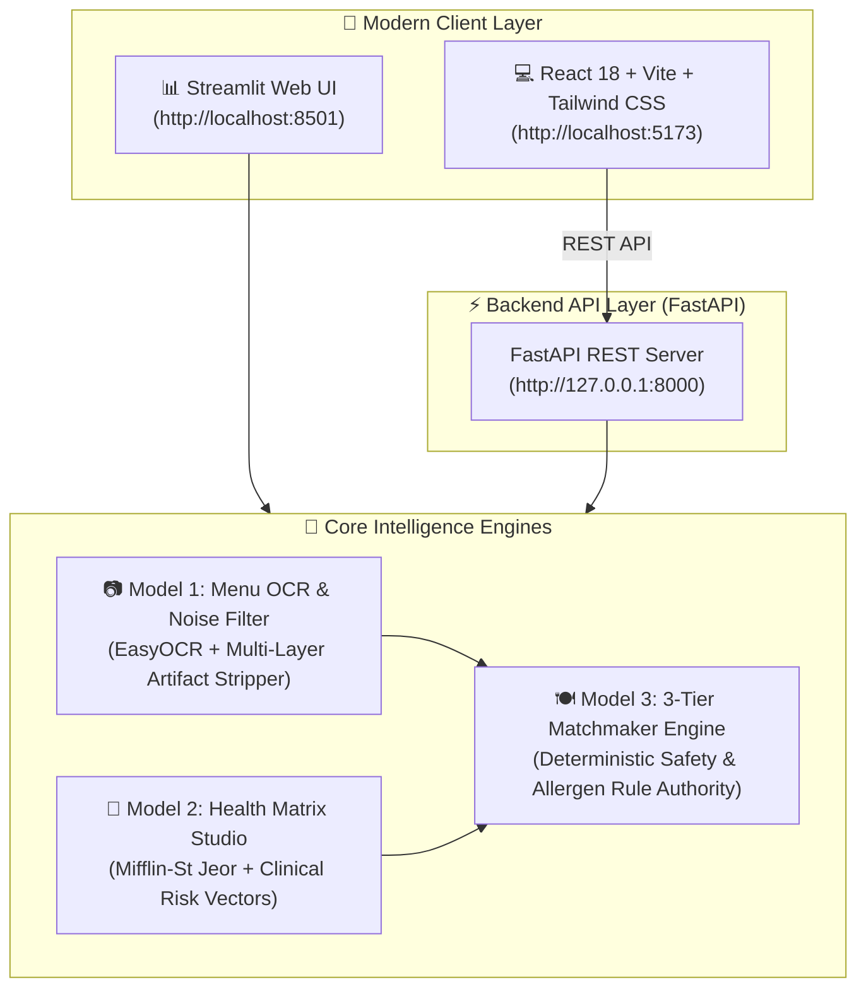

# 🥗 NutriMenu AI — Clinical 3-Tier Food Recommendation Engine

[](https://www.python.org/)
[](https://fastapi.tiangolo.com/)
[](https://react.dev/)
[](https://tailwindcss.com/)
[](https://docs.pytest.org/)
[](LICENSE)

**NutriMenu AI** is an intelligent full-stack clinical recommendation platform that bridges physical restaurant menus with personalized metabolic and medical health matrices to classify food dishes into **🟢 Tier 1: GOOD**, **🟡 Tier 2: MEDIUM**, and **🔴 Tier 3: BAD** tiers.

---

## 🌟 Architecture & System Pipeline



---

## 🧭 3-Step Guided Workflow

```
[ Step 1: 📷 Visual Menu Scanner ] ➔ [ Step 2: 👤 Health Matrix Studio ] ➔ [ Step 3: 🍽️ 3-Tier Recommendations ]
```

### 1. 📷 Step 1: Visual Menu Scanner
- **Drag & Drop OCR**: Upload any PNG/JPG menu photo or scan.
- **Multi-Layer Noise Filter**: Automatically strips non-food noise (URLs like `.site.com`, emails, phone numbers, GST/tax notices, opening hours, branding banners like `FAST FOOD MENU`, `RESTAURANT`, and decorative `XX` glyphs).
- **Auto-Correction**: Fixes common OCR typos (e.g. `French Friea` $\to$ `French Fries`, `Dog` $\to$ `Hot Dog`, `Ice Tea` $\to$ `Iced Tea`, `Cheese Cake` $\to$ `Cheesecake`).
- **Interactive Review**: Preview detected dish names, categories, and price tags with individual delete/edit controls.

### 2. 👤 Step 2: Health Matrix Studio
- **Biometric Inputs**: Age, Gender, Height, Weight, Activity Level, and Primary Metabolic Goal (Fat Loss, Muscle Gain, Maintenance, Healthy Aging).
- **Clinical Condition Toggles**: Hypertension, Type 2 Diabetes, Pre-Diabetes, GERD, Hyperlipidemia, PCOS, Fatty Liver.
- **Zero-Tolerance Allergens**: Peanuts, Tree Nuts, Dairy, Gluten, Shellfish, Eggs, Soy, Sesame.
- **Live Synthesized Matrix**:
  - Daily Calorie Target with deficit/surplus adjustment.
  - Protein, Carbohydrate, and Fat target split bar.
  - Clinical Guardrails (Sodium ceiling, Glycemic sensitivity, Saturated fat limit, Minimum fiber).
  - Hard Exclusion Mask.

### 3. 🍽️ Step 3: 3-Tier Food Recommendation Dashboard
- **KPI Summary**: Total Evaluated, 🟢 Good, 🟡 Medium, and 🔴 Bad counts.
- **Top Recommendation Spotlight**: Highlighted banner showcasing the single best dish for your health matrix.
- **Card Designs**:
  - **🟢 Tier 1: GOOD**: Fit Score badge (`92/100`), green benefit tags (`🌿 High Protein 24g`), and chef customization callouts (`💡 Ask for dressing on the side`).
  - **🟡 Tier 2: MEDIUM**: Caution badges (`⚠️ Moderate Saturated Fat`), and modification tips.
  - **🔴 Tier 3: BAD**: High-visibility allergy conflict banner (`⛔ HARD CONFLICT: Peanuts`), and metabolic risk reasons.
- **Search & Filter**: Filter by tier tabs or search dynamically by keyword.
- **Export Reports**: Instant download in JSON or Markdown format.

---

## ⚡ Quickstart & Installation

### 1. Clone & Install Dependencies

```bash
git clone https://github.com/CodeClosed/AI-Project.git
cd AI-Project

# Install Python backend dependencies
pip install -r requirements.txt

# Install React frontend dependencies
cd frontend
npm install
cd ..
```

---

### 2. Launch the Application

#### Option A: Modern React + FastAPI Full-Stack (Recommended)
Runs both the FastAPI backend and React frontend concurrently:
```bash
python run_fullstack.py
```
- **React Frontend**: [http://localhost:5173](http://localhost:5173)
- **FastAPI Swagger Docs**: [http://127.0.0.1:8000/docs](http://127.0.0.1:8000/docs)

#### Option B: Streamlit Web Dashboard
```bash
python run_ui.py
# or: streamlit run app.py
```
- **Streamlit UI**: [http://localhost:8501](http://localhost:8501)

---

## 🧪 Automated Offline Test Suite

The test suite runs 100% offline without requiring active API keys:

```bash
python -m pytest -v
```

### Test Coverage Highlights:
| Test Module | Focus Area | Status |
| :--- | :--- | :---: |
| `tests/test_noise_filter.py` | Multi-layer noise stripping, regex entropy, typo fixes | ✅ PASSED (6/6) |
| `tests/test_safety_and_rules.py` | Strict allergen exclusions (score = 0), diabetic glycemic penalties | ✅ PASSED (7/7) |
| `tests/test_gemini_client.py` | Typed error handling, timeouts, 429 rate limits, mocked HTTP | ✅ PASSED (9/9) |
| `tests/test_integration_pipeline.py` | End-to-end OCR $\to$ Matrix $\to$ 3-Tier Matchmaker | ✅ PASSED (2/2) |
| `tests/test_recognizer.py` | Layout analysis, bounding box geometry, image stream support | ✅ PASSED (5/5) |

---

## 🛡️ Deterministic Safety Rules & Authority Hierarchy

To guarantee clinical safety, recommendations follow a strict two-stage hierarchy:

```
                      [ Evaluated Dish ]
                              │
               ┌──────────────┴──────────────┐
               ▼                             ▼
       [ Allergen Match? ]         [ Dietary Violation? ]
         (e.g., Peanuts)           (e.g., Meat on Vegetarian)
               │                             │
               └──────────────┬──────────────┘
                              ▼
                     [ Hard Conflict Detected? ]
                              │
                    ┌─────────┴─────────┐
                   YES                  NO
                    ▼                   ▼
           🔴 TIER 3: BAD      [ Calculate Continuous ]
          Fit Score = 0/100    [ Fit Score (0 - 100)  ]
        (Zero AI Override)              │
                                        ▼
                               🟢 GOOD / 🟡 MEDIUM / 🔴 BAD
```

1. **Deterministic Override**: If a dish contains declared allergens (e.g. peanuts, tree nuts, gluten) or violates explicit dietary choices (e.g. meat for a vegetarian), it is **instantly forced to Tier 🔴 BAD (Fit Score = 0)**.
2. **Zero AI Override**: AI generative models are never permitted to override hard safety constraints.

---

## 📡 REST API Documentation

The FastAPI backend exposes standard OpenAPI REST endpoints:

- `POST /api/ocr/extract`: Multipart image file upload. Runs deskewing, enhancement, OCR, and noise filtering. Returns structured dishes.
- `POST /api/matrix/generate`: Accepts user biometrics and clinical conditions. Returns daily metabolic energy and clinical risk vector matrix.
- `POST /api/recommend/evaluate`: Evaluates menu dishes against nutritional matrix and classifies them into 3 tiers.
- `GET /api/health`: Service health and active OCR device (`cuda` / `cpu`).

Interactive documentation is available at [http://127.0.0.1:8000/docs](http://127.0.0.1:8000/docs).

---

## 📁 Repository Structure

```
AI-Project/
├── backend/
│   └── api.py                    # FastAPI REST server
├── frontend/
│   ├── src/
│   │   ├── components/
│   │   │   ├── Stepper.jsx       # 3-step wizard navigation
│   │   │   ├── Step1MenuUpload.jsx # Drag & drop OCR menu scanner
│   │   │   ├── Step2HealthMatrix.jsx # Health profile & live matrix studio
│   │   │   ├── Step3Recommendations.jsx # 3-tier recommendations dashboard
│   │   │   └── DishCard.jsx      # Beautified individual food card
│   │   ├── App.jsx               # Main React application
│   │   ├── api.js                # API client
│   │   └── index.css             # Tailwind CSS & glassmorphic styles
│   ├── package.json
│   └── vite.config.js
├── src/
│   ├── noise_filter.py           # Multi-layer intelligent OCR noise filter
│   ├── matrix_generator.py       # Metabolic baseline & clinical risk generator
│   ├── recommendation_engine.py  # 3-tier classification & safety rule authority
│   ├── ocr_engine.py             # EasyOCR wrapper with CUDA/CPU fallback
│   ├── preprocessing.py          # Image deskewing, CLAHE, and stream handler
│   ├── menu_parser.py            # Geometric & semantic menu parser
│   ├── gemini_client.py          # Resilient HTTP client for Gemini API
│   ├── ui_components.py          # Streamlit UI presentation components
│   └── config.py                 # Centralized configuration & thresholds
├── tests/                        # 100% offline pytest test suites
├── app.py                        # Streamlit application
├── run_fullstack.py              # Full-stack launcher (FastAPI + React)
├── run_ui.py                     # Streamlit launcher
└── requirements.txt              # Python dependencies
```

---

## ℹ️ Medical & Nutritional Guidance Disclaimer

**Notice**: Recommendations provided by NutriMenu AI are personalized computational estimates based on user-entered parameters, Mifflin-St Jeor metabolic equations, and published clinical nutritional literature. This application is not a medical device and does not substitute for personalized medical diagnoses, treatments, or dietary prescriptions from a licensed physician or registered dietitian.
