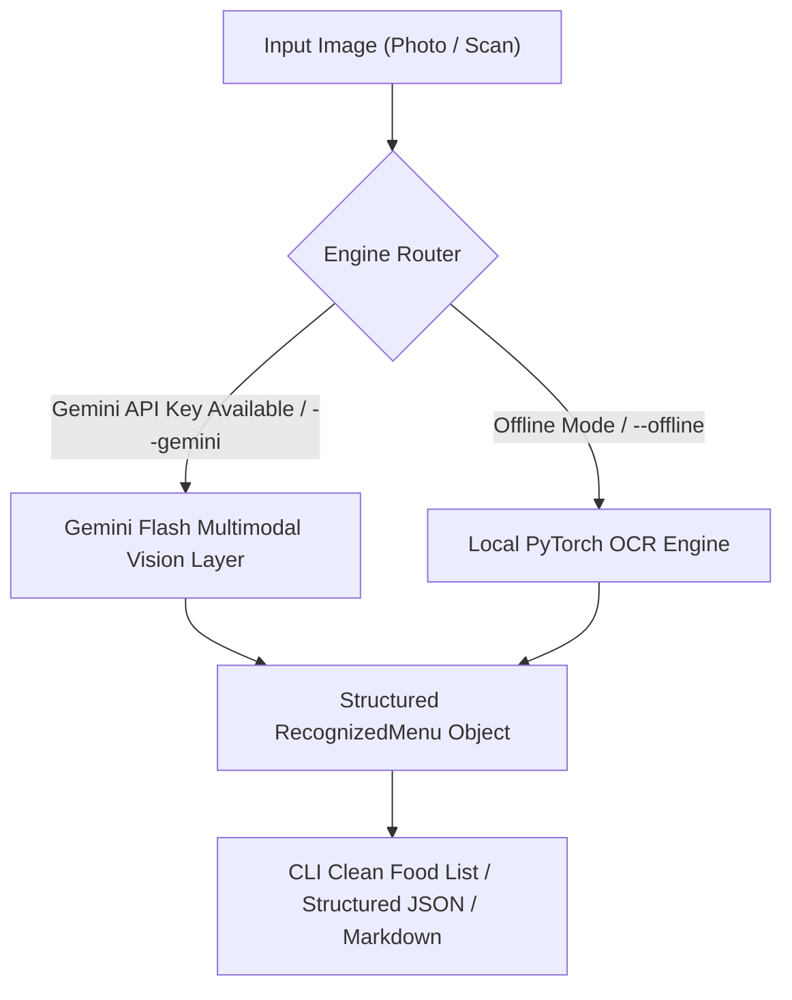

# Component 1: Menu Item Recognition & Layout Parsing System

A hybrid intelligent menu recognition system supporting both **Gemini Flash Vision AI** for zero-shot semantic comprehension and automatic OCR typo correction, alongside a self-contained **local deep-learning OCR pipeline** for offline operation.

---

## 1. System Architecture & High-Level Flow

The system features a dual-mode engine:
1. **Gemini Flash Vision Intelligence**: Uses multimodal vision reasoning to instantly transcribe dishes with 100% spelling precision, fix stylized fonts, classify sections, and isolate edible dishes from modifier notes.
2. **Local Offline Engine**: Uses PyTorch CRAFT + CRNN, spatial gutter histograms, and regex geometric association when running offline.




---

## 2. Component Breakdown

### 2.1 Preprocessing Module (`src/preprocessing.py`)
- **Deskewing**: Uses edge detection (`cv2.Canny`) and probabilistic Hough line transforms (`cv2.HoughLinesP`) to compute the median orientation angle of text rows and rotates the image to a leveled horizontal orientation.
- **Illumination & Shadow Normalization**: Operates in LAB color space, extracts the L-channel (luminance), estimates background gradients with morphological opening filters (`cv2.morphologyEx`), and normalizes uneven lighting.
- **Contrast Enhancement**: Applies Contrast Limited Adaptive Histogram Equalization (`cv2.createCLAHE`) to enhance faint or stylized text against busy background textures.
- **Dynamic Rescaling**: Dynamically scales high-res or low-res input images to an optimal resolution range (800px – 2400px) for neural character detection.

### 2.2 Local Deep OCR Engine (`src/ocr_engine.py`)
- **PyTorch Offline Neural OCR**: Uses EasyOCR's character-region-awareness CRAFT text detector alongside deep convolutional recurrent neural networks (CRNN) with CTC loss.
- **Artifact & Leader Dot Suppression**: Detects and standardizes menu fill characters (e.g. `Steak ........... $24.99` or `---` dashes) while preserving the spatial anchor between item titles and prices.
- **Confidence Filtering**: Discards OCR noise beneath the configurable confidence threshold (default: `0.20`).

### 2.3 Spatial Layout Analyzer (`src/layout_analyzer.py`)
- **Multi-Column Gutter Detection**: Constructs horizontal projection coverage histograms across the width of the page to find gutter valleys, segmenting 1, 2, or 3-column menu layouts.
- **Horizontal Line Merging**: Merges adjacent word fragments sharing significant vertical overlap into single text rows while respecting wide gaps reserved for right-aligned prices.
- **Reading Order Reconstruction**: Generates a canonical reading order traversal: top-to-bottom within Column 0, followed by Column 1, etc.

### 2.4 Semantic Menu Parser (`src/menu_parser.py`)
- **Category & Section Classifier**: Detects section headers (e.g., *Appetizers, Main Courses, Pasta, Pizzas, Desserts, Beverages*) based on font height scaling (>= 1.35x median text height), casing heuristics (ALL CAPS / Title Case), and an extensive culinary ontology.
- **Multi-Currency & Price Extractor**: Robust regex engine supporting `$`, `£`, `€`, `₹`, `USD`, `EUR`, `INR`, decimal values (`14.99`), integer values (`15`), dash notation (`14.-`), and European comma formatting (`14,50`).
- **Geometric Item-to-Price Associator**: Links prices to their corresponding item names based on horizontal row alignment and geometric proximity.
- **Description & Modifier Extractor**: Captures ingredient lists and multi-line descriptions directly underneath item titles and attaches them to the parent item.
- **Dietary Tag Extraction**: Identifies and parses tags like `(V)` (Vegetarian), `(VG)` (Vegan), `(GF)` (Gluten-Free), `(DF)` (Dairy-Free), `Halal`, and `Spicy`.

### 2.5 Diagnostic Visualizer (`src/visualizer.py`)
- Renders an annotated inspection image with color-coded bounding boxes:
  - **Purple**: Section / Category Headers
  - **Blue**: Menu Item Titles & Dietary Badges
  - **Green**: Price Bounding Boxes
  - **Cyan Arrows**: Geometric Association Links between Items and Prices

---

## 3. Data Models (`src/models.py`)

All outputs are strongly-typed data structures with full dictionary, JSON, and Markdown serialization:

```python
@dataclass
class MenuItem:
    name: str
    price: Optional[float] = None
    raw_price: Optional[str] = None
    currency: Optional[str] = None
    description: Optional[str] = None
    section: Optional[str] = None
    dietary_tags: List[str] = field(default_factory=list)
    confidence: float = 1.0
    bbox: Optional[BoundingBox] = None
    price_bbox: Optional[BoundingBox] = None

@dataclass
class MenuSection:
    title: str
    items: List[MenuItem] = field(default_factory=list)
    bbox: Optional[BoundingBox] = None

@dataclass
class RecognizedMenu:
    image_path: str
    image_width: int
    image_height: int
    num_columns: int
    sections: List[MenuSection] = field(default_factory=list)
    unclassified_items: List[MenuItem] = field(default_factory=list)
    raw_blocks: List[TextBlock] = field(default_factory=list)
    metadata: Dict[str, Any] = field(default_factory=dict)
```

---

## 4. Usage Guide

### 4.1 CLI Usage

#### Extract ONLY clean menu item names (one per line):
```bash
python -m src.pipeline --image path/to/menu.jpg --items-only
```
*Outputs:*
```
Chicken Butter Masala
Chips
Mango Salad
Paneer Tikka
```

#### Extract items only and save to JSON list:
```bash
python -m src.pipeline --image path/to/menu.jpg --items-only --output items.json
```

#### Full extraction with sections, prices, visual debug overlay, and markdown:
```bash
python -m src.pipeline --image path/to/menu.jpg --output results.json --visualize annotated_menu.jpg --markdown menu_summary.md
```

#### Optional CLI Flags:
- `--items-only`: Prints strictly the clean list of food items found.
- `--cpu`: Force CPU execution (useful for environments without CUDA).
- `--no-deskew`: Disables automatic deskew rotation if the image is already oriented.

---

### 4.2 Python API Usage

#### Get Pure List of Food Items:
```python
from src.pipeline import MenuRecognitionPipeline

pipeline = MenuRecognitionPipeline()

# Extracts ONLY food/drink items (e.g. ['Chicken Butter Masala', 'Chips', 'Mango'])
food_items = pipeline.extract_menu_items("path/to/menu.jpg")
print(food_items)
```

#### Full Hierarchical Extraction:
```python
from src.pipeline import MenuRecognitionPipeline

pipeline = MenuRecognitionPipeline()

# Full structured extraction
menu = pipeline.process_image("path/to/menu.jpg", visualize_path="annotated.jpg")

# Access only food item names directly from the menu object:
items_list = menu.get_item_names()
print(items_list)
```

