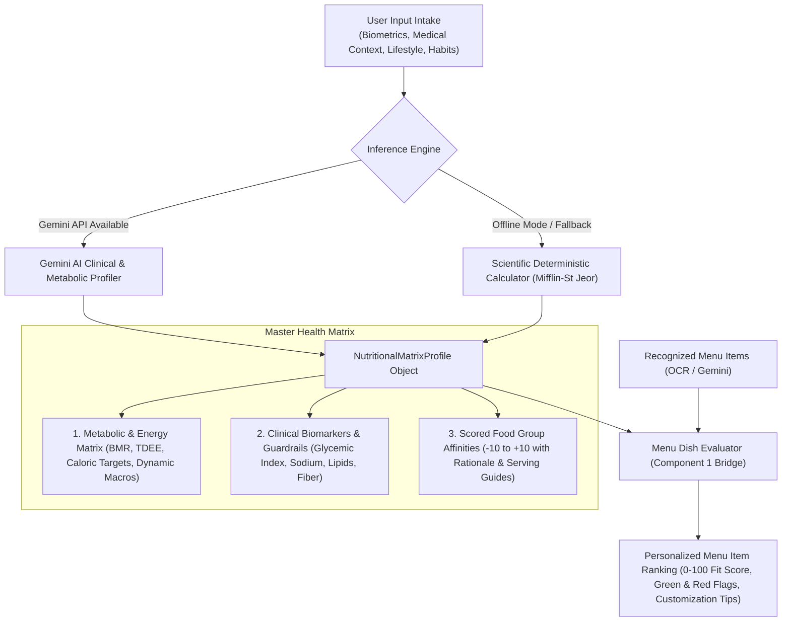

# Component 2: AI-Powered Nutritional Health Matrix & Food Group Recommendation System

An intelligent clinical nutrition and metabolic profiling engine powered by **Google Gemini AI**. It transforms raw biometric data, lifestyle habits, medical conditions, and dietary goals into a multidimensional **Health & Metabolic Matrix**, scores **Food Group Affinities** with clinical reasoning, and evaluates scanned restaurant menu items for personalized dietary fit.

---

## 1. System Architecture & High-Level Flow



---

## 2. Core Concepts & Mathematical Formulations

### 2.1 Metabolic Baselines
1. **Basal Metabolic Rate (BMR)**: Calculated using the **Mifflin-St Jeor Equation**:
   $$\text{BMR} = 10 \times \text{weight (kg)} + 6.25 \times \text{height (cm)} - 5 \times \text{age (years)} + s$$
   *(where $s = +5$ for males, $-161$ for females)*

2. **Total Daily Energy Expenditure (TDEE)**:
   $$\text{TDEE} = \text{BMR} \times \text{Physical Activity Level (PAL)}$$
   - *Sedentary*: $1.2$
   - *Lightly Active*: $1.375$
   - *Moderately Active*: $1.55$
   - *Very Active*: $1.725$
   - *Athlete / Extreme*: $1.9$

3. **Goal Adjustment Factor**:
   - *Fat Loss Deficit*: $-15\%$ to $-25\%$
   - *Lean Hypertrophy Surplus*: $+5\%$ to $+15\%$
   - *Maintenance / Metabolic Reset*: $0\%$

---

## 3. Multidimensional Health Matrix Components

### 3.1 Metabolic & Macronutrient Split (`MetabolicEnergyMatrix`)
- **Protein Target ($g$, $\%$ of calories)**: Scaled dynamically based on activity and deficit to protect lean muscle mass.
- **Carbohydrate Target ($g$, $\%$ of calories)**: Modulated based on glycemic sensitivity and training intensity.
- **Fat Target ($g$, $\%$ of calories)**: Calibrated for essential hormonal production and satiety.

### 3.2 Clinical Biomarkers & Guardrails (`ClinicalGuardrailMatrix`)
- **Glycemic Sensitivity Index ($0.0 - 1.0$)**: Degree of insulin resistance or glycemic concern ($1.0 = \text{strict low GI}$).
- **Daily Sodium Guardrail ($\text{mg/day}$)**: Enforces $1500\text{ mg}$ for hypertension or $2300\text{ mg}$ standard.
- **Saturated Fat Ceiling ($\%$)**: Capped at $<6\%$ for cardiovascular / high LDL risk.
- **Minimum Soluble & Total Fiber ($\text{g/day}$)**: Prioritizes beta-glucans and viscous fibers for cholesterol binding and glucose stabilization.
- **Digestive Sensitivity / Trigger Mask**: Identifies foods causing acid reflux (GERD), IBS symptoms, or lactose distress.

### 3.3 Food Group Scoring Matrix (`FoodGroupAffinity`)
Every major food group is scored on a scale from **$-10$ to $+10$**:
- **$+10$ (Essential / Top Tier)**: Maximum micronutrient density and therapeutic benefit.
- **$+5$ to $+9$ (Recommended)**: Strong metabolic fit.
- **$0$ to $+4$ (Moderate / Neutral)**: Acceptable in measured portions.
- **$-1$ to $-7$ (Restrict / Limit)**: Suboptimal for current clinical goals.
- **$-8$ to $-10$ (Strictly Avoid / Forbidden)**: Severe allergen, ethical violation, or acute medical contraindication.

---

## 4. Data Models (`src/user_models.py`)

```python
@dataclass
class UserProfile:
    age: Optional[int] = None
    gender: Optional[str] = None
    height_cm: Optional[float] = None
    weight_kg: Optional[float] = None
    activity_level: Optional[str] = "sedentary"
    primary_goal: Optional[str] = "maintenance"
    health_conditions: List[str] = field(default_factory=list)
    allergies: List[str] = field(default_factory=list)
    dietary_preferences: List[str] = field(default_factory=list)
    raw_bio_text: Optional[str] = None

@dataclass
class NutritionalMatrixProfile:
    user_summary: str
    metabolic_matrix: MetabolicEnergyMatrix
    clinical_guardrails: ClinicalGuardrailMatrix
    food_group_affinities: List[FoodGroupAffinity]
    excluded_allergens_and_restrictions: List[str]
    top_recommended_food_groups: List[str]
    food_groups_to_limit: List[str]

@dataclass
class DishEvaluationResult:
    dish_name: str
    fit_score: int                   # 0 to 100
    verdict: str                     # e.g. "Top Recommendation", "Healthy Choice"
    matched_food_groups: List[str]
    green_flags: List[str]
    red_flags: List[str]
    estimated_calories: Optional[int]
    estimated_protein_g: Optional[int]
    customization_tips: Optional[str]
```

---

## 5. Usage Guide

### 5.1 Generating Nutritional Matrix from Structured Profile or Natural Language

```python
from src.nutrition_ai import AINutritionProfiler
from src.user_models import UserProfile

profiler = AINutritionProfiler()

# Option A: From structured profile
profile = UserProfile(
    age=32,
    gender="male",
    height_cm=178,
    weight_kg=84,
    activity_level="sedentary",
    primary_goal="fat_loss",
    health_conditions=["hypertension", "pre_diabetes"],
    dietary_preferences=["vegetarian"],
    allergies=["peanuts"]
)
matrix = profiler.generate_matrix(profile)

# Option B: From natural language bio text
bio_matrix = profiler.generate_matrix(
    "35yo female, 65kg, 162cm, desk job, mild PCOS, wants to lose fat and maintain energy."
)

# Print human-readable markdown card
print(matrix.to_markdown())
```

---

### 5.2 Evaluating Scanned Menu Dishes against User Matrix

```python
from src.dish_evaluator import MenuDishEvaluator
from src.pipeline import MenuRecognitionPipeline

# 1. Recognize menu dishes from image (Component 1)
pipeline = MenuRecognitionPipeline()
recognized_menu = pipeline.process_image("examples/indian_menu.png")

# 2. Bridge with User's AI Matrix (Component 2)
evaluator = MenuDishEvaluator(user_matrix=matrix)
ranked_dishes = evaluator.evaluate_menu(recognized_menu)

# 3. Inspect top recommended dishes
for dish in ranked_dishes[:5]:
    print(f"[{dish.fit_score}/100] {dish.dish_name} - {dish.verdict}")
    print(f"  Green Flags: {', '.join(dish.green_flags)}")
    if dish.red_flags:
        print(f"  Red Flags: {', '.join(dish.red_flags)}")
    if dish.customization_tips:
        print(f"  Tip: {dish.customization_tips}")
```

---

## 6. CLI Demo Execution

Run the interactive demo script:
```bash
python examples/user_nutrition_demo.py
```
