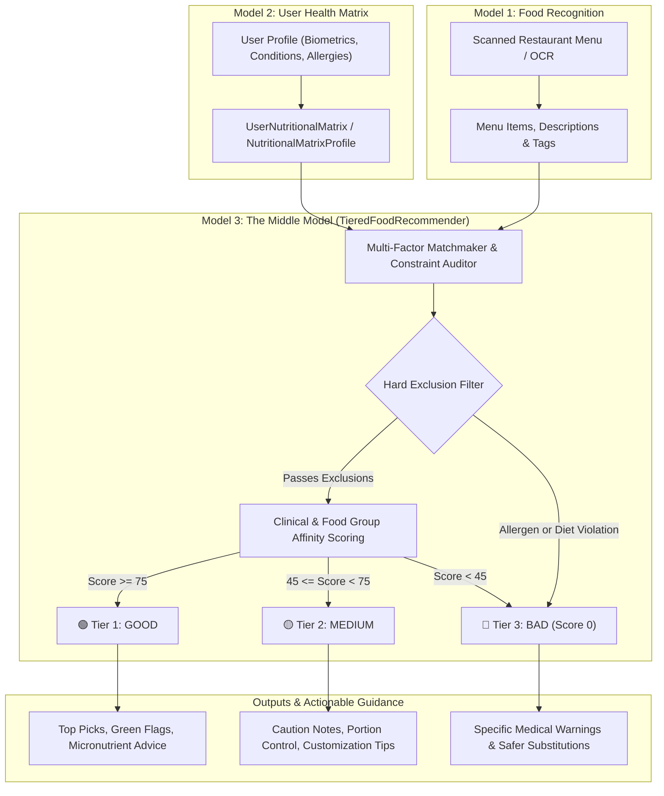

# Part 3: 3-Tier Food Recommendation Engine (The Middle Model)

An intelligent clinical nutrition matchmaking engine that acts as the **Middle Model** bridging:
1. **Model 1 (Food / Menu Recognition)**: Menu items, ingredients, preparation methods, and constituent food groups.
2. **Model 2 (User Health & Nutritional Matrix)**: Biometrics, BMR/TDEE targets, clinical risk weights, quantitative guardrails, food group compatibility scores, and strict exclusion masks.

The middle model evaluates any food item or scanned restaurant menu against the user's health matrix and categorizes every item into **three distinct tiers**:
- 🟢 **Tier 1: GOOD** (Optimal Fit, Safe, Health-Promoting, Score $\ge 75$)
- 🟡 **Tier 2: MEDIUM** (Moderate, Acceptable in Moderation or with Customizations, Score $45 - 74$)
- 🔴 **Tier 3: BAD** (Avoid, Conflicts with Medical Guardrails, Violates Allergies or Strict Diets, Score $< 45$)

---

## 1. System Architecture & High-Level Flow



---

## 2. The 3 Tiers Defined

### 🟢 Tier 1: GOOD (Recommended / Optimal Metabolic Fit)
- **Qualification**: Fit Score $\ge 75 / 100$.
- **Criteria**:
  - High alignment with the user's top positive food group affinities (e.g. leafy greens, cruciferous vegetables, lean proteins, whole grains).
  - Low-fat, clean preparation methods (steamed, grilled, tandoori, baked, raw salad).
  - Keeps sodium, saturated fat, and glycemic load well within user guardrails.
  - Zero allergen or dietary conflict.
- **Includes**: Green flags highlighting metabolic benefits, exact fit score, and serving suggestions.

### 🟡 Tier 2: MEDIUM (Moderate / Consume with Caution)
- **Qualification**: Fit Score $45 - 74 / 100$.
- **Criteria**:
  - Neutral food group composition or moderate caloric/macro density.
  - May have moderate amounts of saturated fat, sodium, or refined carbs that require portion care.
  - Completely free of hard allergens and diet restrictions, but not optimal for primary health goals.
- **Includes**: Caution areas and **actionable customization tips** (e.g. *"Ask for dressing on the side"*, *"Substitute white rice for multigrain roti"*).

### 🔴 Tier 3: BAD (Avoid / High Risk / Contraindicated)
- **Qualification**: Fit Score $< 45 / 100$ OR Hard Exclusion Violation.
- **Criteria**:
  - **Instant 0 Score**: Contains declared user allergens (peanuts, shellfish, dairy, gluten, etc.) or violates religious/ethical diets (meat/poultry for vegetarians, non-halal).
  - **Clinical Conflict**: Deep-fried foods, high glycemic refined sugars for diabetics, excessive sodium for hypertension, or acidic triggers for GERD.
- **Includes**: Explicit allergen alerts, red flags, and healthier alternatives.

---

## 3. Data Models & Interface (`src/recommendation_engine.py`)

### 3.1 `FoodTier` Enum
```python
class FoodTier(str, Enum):
    GOOD = "GOOD"        # 🟢 Optimal metabolic fit
    MEDIUM = "MEDIUM"    # 🟡 Acceptable with portion care
    BAD = "BAD"          # 🔴 Violates allergies/diets or high clinical risk
```

### 3.2 `TieredFoodRecommendation`
```python
@dataclass
class TieredFoodRecommendation:
    dish_name: str
    tier: FoodTier                              # GOOD | MEDIUM | BAD
    fit_score: int                               # 0 to 100
    summary_reason: str                          # High-level concise verdict
    matched_food_groups: List[str]               # e.g. ["Plant Protein", "Cruciferous Veg"]
    green_flags: List[str]                       # Positive health attributes
    red_flags: List[str]                         # Clinical risk factors
    allergen_warnings: List[str]                 # Hard allergy alerts
    customization_tips: Optional[str]            # Actionable modification guidance
    estimated_calories: Optional[int]            # Estimated kcal
    estimated_protein_g: Optional[int]           # Estimated protein grams
    price: Optional[str]                         # Menu price if available
```

### 3.3 `TieredRecommendationResult`
Consolidates evaluations for an entire restaurant menu:
- `good_items`: List of Tier 1 recommendations.
- `medium_items`: List of Tier 2 recommendations.
- `bad_items`: List of Tier 3 avoidances.
- `top_pick`: The single highest scoring dish.
- `tier_counts`: `{"GOOD": count, "MEDIUM": count, "BAD": count}`.
- `.to_json()`: Complete structured API payload.
- `.to_markdown()`: Beautiful Markdown report card.

---

## 4. Usage Guide

### 4.1 Quick Single Dish Recommendation
```python
from src.matrix_generator import AIMatrixGenerator
from src.recommendation_engine import TieredFoodRecommender

# Step 1: Create user matrix (Model 2)
matrix_gen = AIMatrixGenerator()
user_matrix = matrix_gen.generate({
    "age": 42,
    "gender": "female",
    "primary_goal": "fat_loss",
    "health_conditions": ["hypertension", "pre_diabetes"],
    "allergies": ["peanuts"],
    "dietary_preferences": ["vegetarian"]
})

# Step 2: Initialize Middle Model (Model 3)
recommender = TieredFoodRecommender(user_matrix=user_matrix)

# Step 3: Recommend a dish (Model 1 input)
rec = recommender.recommend_dish({
    "name": "Palak Paneer",
    "description": "Spinach curry with cottage cheese",
    "price": "$12.99"
})

print(rec.tier)          # FoodTier.GOOD
print(rec.fit_score)     # 98
print(rec.green_flags)   # ['High in dietary fiber...', 'High protein density...']
```

### 4.2 Full Menu Recommendation
```python
from src.pipeline import MenuRecognitionPipeline
from src.recommendation_engine import TieredFoodRecommender

# 1. Recognize menu from image (Model 1)
ocr_pipe = MenuRecognitionPipeline()
recognized_menu = ocr_pipe.process_image("path/to/restaurant_menu.jpg")

# 2. Match with user matrix (Model 3)
recommender = TieredFoodRecommender(user_matrix=user_matrix)
result = recommender.recommend_menu(recognized_menu)

# 3. Access tiered results
print(f"Good: {result.tier_counts['GOOD']}, Medium: {result.tier_counts['MEDIUM']}, Bad: {result.tier_counts['BAD']}")
print(f"Top Pick: {result.top_pick.dish_name} ({result.top_pick.fit_score}/100)")

# 4. Export report
print(result.to_markdown())
```

---

## 5. Dual Evaluation Engines

1. **AI Matchmaking Engine**: Powered by Google Gemini Flash in structured JSON mode for nuanced contextual understanding, ingredient inference, and tailored culinary customization tips.
2. **Deterministic Rule Engine**: High-speed, 100% offline rule-based scoring engine incorporating Mifflin-St Jeor metabolic equations, sodium ceilings, glycemic penalty scaling, and regex dietary constraint auditing. Ensures uninterrupted offline availability and zero latency.
