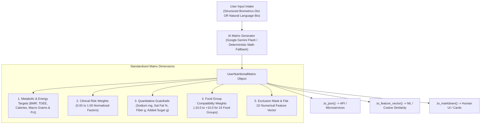

# Standalone User Nutritional & Recommendation Metric Matrix Generator

A pure, decoupled **AI-Powered Nutritional Matrix Engine** that converts raw user inputs (biometrics, health conditions, lifestyle habits, goals, allergies) into a standardized, multidimensional **Mathematical & Clinical Metric Matrix**.

This matrix is decoupled from any specific UI or image pipeline and can be exported as a **JSON object**, **Python dictionary**, **flat 1D numerical feature vector**, or **Markdown report** for consumption by any downstream system (recommendation algorithms, linear programming meal optimizers, vector databases, mobile apps).

---

## 1. System Flow & Architecture



---

## 2. Matrix Dimensions & Schema

### 2.1 Metabolic & Energy Targets (`MetabolicTargets`)
- `bmr_kcal` ($float$): Basal Metabolic Rate via Mifflin-St Jeor equation.
- `tdee_kcal` ($float$): Total Daily Energy Expenditure scaled by Physical Activity Level (PAL).
- `target_calories_kcal` ($float$): Goal-adjusted caloric target (e.g. $-20\%$ for fat loss, $+10\%$ for hypertrophy).
- `caloric_adjustment_ratio` ($float$): E.g. `-0.20` or `+0.10`.
- `target_protein_g`, `target_protein_pct` ($float$): Dynamic protein requirements.
- `target_carbs_g`, `target_carbs_pct` ($float$): Carbohydrate requirements.
- `target_fats_g`, `target_fats_pct` ($float$): Fat requirements.
- `protein_g_per_kg` ($float$): Grams of protein per kg body weight (e.g. $1.6 - 2.2\text{ g/kg}$).
- `target_water_liters` ($float$): Daily minimum hydration baseline.
- `strategy_summary` ($str$): Clinical summary of metabolic strategy.

### 2.2 Clinical Risk Weights (`ClinicalRiskWeights`)
Normalized continuous variables ($0.00$ to $1.00$) suitable for linear weights and algorithmic loss functions:
- `glycemic_sensitivity`: Insulin sensitivity / glucose spike avoidance ($1.0 = \text{diabetic/insulin resistant}$).
- `cardiovascular_risk_weight`: Arterial strain and blood pressure focus ($1.0 = \text{hypertensive}$).
- `lipid_optimization_weight`: Atherogenic lipoprotein sensitivity ($1.0 = \text{hyperlipidemia / elevated LDL}$).
- `inflammation_index_weight`: Systemic inflammation sensitivity.
- `digestive_sensitivity_weight`: Gastrointestinal fragility ($1.0 = \text{active GERD/acid reflux/IBS}$).
- `satiety_demand_weight`: Satiety and volume requirement during deficit.

### 2.3 Quantitative Guardrails (`NutritionalGuardrails`)
Hard boundary conditions:
- `sodium_ceiling_mg`: Daily upper limit (e.g., $1500\text{ mg}$ for hypertension, $2300\text{ mg}$ standard).
- `saturated_fat_max_pct`: Maximum fraction of total calories (e.g., $<0.06$ for LDL management).
- `added_sugar_max_g`: Strict upper bound on refined sucrose/fructose ($\text{g/day}$).
- `dietary_fiber_min_g`: Minimum target for total & soluble fiber ($\text{g/day}$).
- `potassium_target_mg`: Target daily electrolyte intake ($\text{mg/day}$).
- `omega3_min_g`: Target anti-inflammatory fatty acids ($\text{g/day}$).
- `digestive_triggers_to_avoid`: List of forbidden digestive irritants.

### 2.4 Food Group Compatibility Weights (`food_group_weights`)
A comprehensive dictionary mapping 24 standardized food groups to a continuous score from **$-10.0$ to $+10.0$**:
- `cruciferous_vegetables`, `dark_leafy_greens`, `allium_and_colorful_vegetables`, `starchy_tubers`, `whole_grains_and_millets`, `refined_carbohydrates`, `legumes_pulses_and_beans`, `plant_based_proteins_tofu_tempeh`, `fatty_coldwater_fish_omega3`, `lean_white_fish_and_seafood`, `lean_poultry`, `eggs_and_egg_whites`, `red_meat_and_game`, `processed_and_cured_meats`, `fermented_probiotic_foods`, `low_fat_dairy`, `full_fat_dairy_and_cheese`, `nuts_and_seeds`, `healthy_unsaturated_oils_olive_avocado`, `saturated_and_trans_fats`, `low_gi_berries_and_fruits`, `high_sugar_fruits_and_juices`, `added_sugars_and_confectionery`, `deep_fried_and_ultra_processed`.

### 2.5 Exclusion Mask & Feature Vector
- `exclusion_mask` ($List[str]$): Hard filter keywords for allergens and strict dietary restrictions (e.g., `["peanuts", "meat", "poultry", "fish", "shellfish"]`).
- `.to_feature_vector()` ($List[float]$): A flat 20-dimensional numeric vector for ML pipelines.

---

## 3. Usage Guide

### 3.1 Generating Matrix from a Structured Profile

```python
from src.matrix_generator import AIMatrixGenerator

generator = AIMatrixGenerator()

user_data = {
    "age": 34,
    "gender": "male",
    "height_cm": 178,
    "weight_kg": 84,
    "activity_level": "sedentary",
    "primary_goal": "fat_loss",
    "health_conditions": ["hypertension", "pre_diabetes"],
    "dietary_preferences": ["vegetarian"],
    "allergies": ["peanuts"]
}

# Generate complete matrix
matrix = generator.generate(user_data, user_id="user_101")

# Export to JSON
json_output = matrix.to_json(indent=2)

# Export to flat numeric vector for ML
feature_vec = matrix.to_feature_vector()
print(f"Feature vector shape: {len(feature_vec)} dims -> {feature_vec}")

# Export to Markdown card
print(matrix.to_markdown())
```

---

### 3.2 Generating Matrix from Natural Language Bio Text

```python
from src.matrix_generator import AIMatrixGenerator

generator = AIMatrixGenerator()

bio = (
    "I'm a 29-year-old female software engineer, 62kg, 165cm, sitting all day. "
    "I have PCOS and lactose intolerance, workout 3x a week, and want to lose 4kg "
    "without feeling fatigued or having blood sugar dips."
)

matrix = generator.generate(bio, user_id="user_102")
print(f"BMR: {matrix.metabolic_targets.bmr_kcal} kcal")
print(f"Target Calories: {matrix.metabolic_targets.target_calories_kcal} kcal")
print(f"Glycemic Sensitivity: {matrix.clinical_risk_weights.glycemic_sensitivity}")
print(f"Leafy Greens Weight: {matrix.food_group_weights.get('dark_leafy_greens')}")
```

---

## 4. How Downstream Systems Consume This Matrix

1. **Recommender Systems (Content-Based / Collaborative Filtering)**:
   - Compute cosine similarity or dot product between the food group weight dictionary and a food item's composition vector.
2. **Linear Programming & Diet Optimization**:
   - Use `metabolic_targets` and `nutritional_guardrails` directly as upper and lower constraints in solvers like `scipy.optimize.linprog` or PuLP.
3. **Database Filtering**:
   - Use `exclusion_mask` as hard `WHERE NOT IN` filters.
   - Rank dishes using `food_group_weights`.
